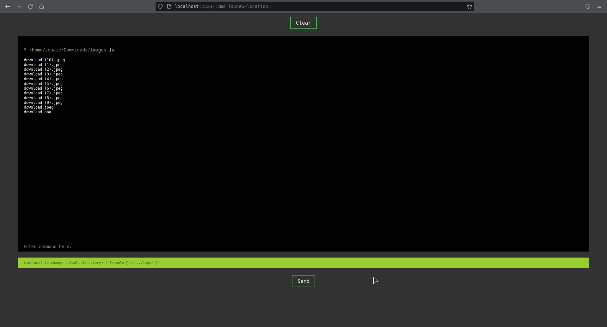
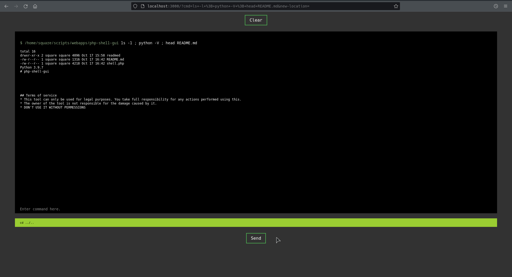

# php-shell-gui

<br><br>

## Terms of service
* This tool can only be used for legal purposes. You take full responsibility for any actions performed using this. 
* The owner of the tool is not responsible for the damage caused by it.
* DON'T USE IT WITHOUT PERMESSIONS

<br>

## Informations

I think I tried to make this shell look like an terminal in one PHP file. (EASY TO SETUP)
this is just a beta version. Please report any mistake you've encountered.

<br>


## Shell-showcase




<br>

## Setup

#### Installation

```cmd
git clone https://github.com/FatSquare/php-shell-gui.git
```

#### Running the script

```cmd
php -S localhost:3000 shell.php
```

<br>

## Usage

The first black input will take whatever command you give it, execute it and print the results.

However typing something like :

```bash
# this will list the files in the download directory

$ cd Downloads/;ls;
```
```bash
# this will list the files in the old directory

$ cd Downloads/
$ ls;
```
Will work but won't save the new path for the next line. so typing ls again will actually print the old path
To fix that you can type your cd commands in the green input field (if you want to)
i will try to remove the green input and save the new directory when you type the command in the first input
