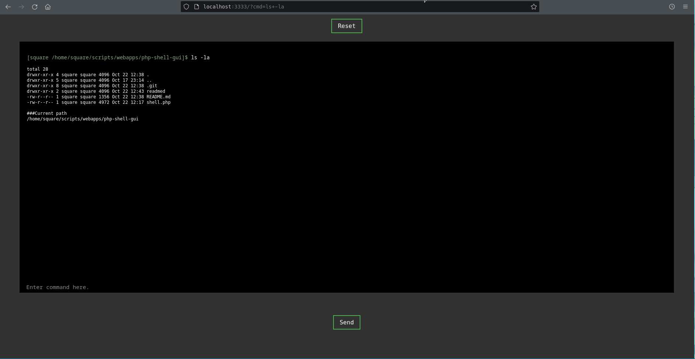

# php-shell-gui

<br><br>

## Terms of service
* This tool can only be used for legal purposes. You take full responsibility for any actions performed using this. 
* The owner of the tool is not responsible for the damage caused by it.
* DON'T USE IT WITHOUT PERMESSIONS

<br>

## Informations

I think I tried to make this shell look like an terminal in one PHP file. (EASY TO SETUP)
this is just a beta version. Please report any mistake you've encountered.

<br>

## Setup

#### Installation

```cmd
git clone https://github.com/FatSquare/php-shell-gui.git
```

#### Running the script

```cmd
php -S localhost:3000 shell.php
```

<br>

## Shell-preview



